<p align="center">
  
</p>

<p align="center">
  <a href="https://cheata.io"></a>
</p>

<p align="center">
  <a href="https://cheata.io"></a>
  <a href="https://etherscan.io/address/0x5C5CEa5F9466D8fd9B8D9b3Bd0F4705fc4A7ae74"></a>
  
</p>

## About

**CheatA** is a Web3 browser that brings an MP wallet, a DEX, DeFi, staking, and a DApps builder together in one place.
It reads directly from the original **MP** contract, deployed to Ethereum Mainnet in 2018.

## Projects

| Project | Description |
|---|---|
| [**CheatA Web3 Browser**](https://cheata.io) | MP Wallet / CheatA DEX / DeFi Dashboard / Staking / DApps Builder |
| **Original MP — Ethereum Archive** | On-chain evidence archive for the original MP contract (transactions, bytecode, RPC reads, SHA-256 hashes) |

## MP on-chain facts

```text
Network      Ethereum Mainnet (Chain ID 1)
Contract     0x5C5CEa5F9466D8fd9B8D9b3Bd0F4705fc4A7ae74
Created      Block 5,727,601 · 2018-06-03 22:59:16 UTC
Token        MP / MP · 8 decimals · 10,000,000,000 supply
```
## Tech stack

<p>
  
  
  
  
  
  
  
  
  
</p>

## Principles

- Verifiable facts only — publish what can be checked on-chain
- Build in public — share progress and limitations openly
- Protect users first — assets and secrets come before features

## Safety

The CheatA team will never ask for your private key, seed phrase, password, or a transfer via DM.
Only trust official links from [cheata.io](https://cheata.io) and this GitHub account.

<sub>This profile shares technical and historical information. It is not investment advice or a guarantee of value.</sub>
